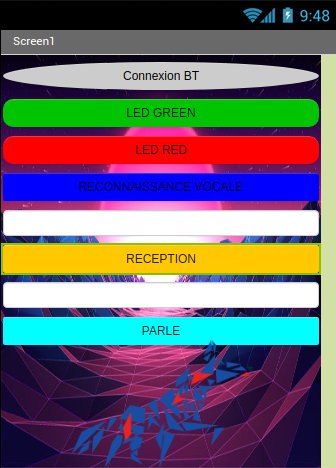
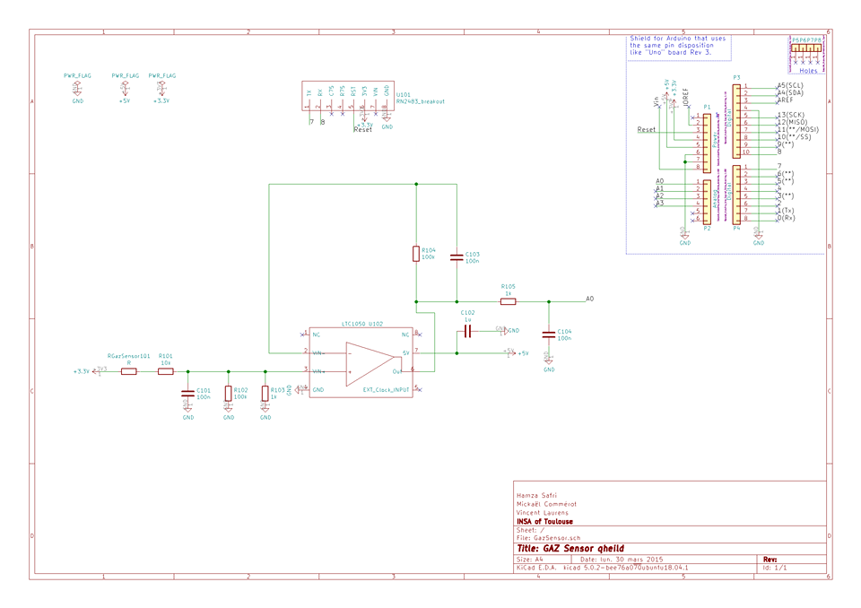

 <header>
 
 
 </header>
 <h1 style="text-align:center" >2019_MOSH_A1_VLAURENS_COMMEROT_SAFRI</h1>

## 1. Travaux Pratiques sur Arduino

Ces travaux pratiques avaient pour principal objectif de nous apprendre à développer la partie intelligente de nos capteurs de gaz. En d'autres mots nous avons dans cette partie appris la composition d'une carte Arduino. Nous avons appris à pousser et tester des programmes sur le micro-controleur ATMEGA128 qui le compose.
Nous avons aussi appris à interfacer des circuit électroniques d'acquistion de données (capteurs) ou encore des circuits de puissances comme commander un cerveau moteur. 
Enfin nous avons développé un programme communicant via bluetooth avec le téléphne et qui permettait via une application android de commander l'allumage de LED.
Cette application android possédait des commande via button classique ou un module de reconnaissance vocale qui commandait l'arduino par des mot-clefs.

<figure class="image">
  
  <figcaption>Figure 1 : Aperçu de l'application Android</figcaption>
</figure>

# 2. PCB design 

Dans un second temps, nous avons réalisé un projet qui visait à développé un module lora permettant de récupérer les valeurs de Gaz ambiant et les stocker sur une plateforme cloud.

Nous avons du donc interfacer l'antenne lora et surtout le capteur de gaz avec l'arduino uno.

Pour cela nous avons implémenté un montage sugéré par Monsieur Noullet (https://noullet-gei.gitlab.io/iss_analog/) dont le rôle de filtre passe-bande est d'extraire toute l'information utile du capteur et atténuer la composante de bruit.

<figure class="image">
  
  <figcaption>Figure 1 : LTSpice scheme</figcaption>
</figure>

Nous avons ensuite à l'aide kicad conçu une carte pouvant se gréffer à la carte Arduino Uno et comportant le capteur de gaz et l'antenne LORA.

<figure class="image">
  
  <figcaption>Figure 1 : LTSpice scheme</figcaption>
</figure>

<figure class="image">
  
  <figcaption>Figure 1 : LTSpice scheme</figcaption>
</figure>

<figure class="image">
  
  <figcaption>Figure 1 : LTSpice scheme</figcaption>
</figure>