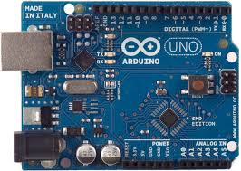
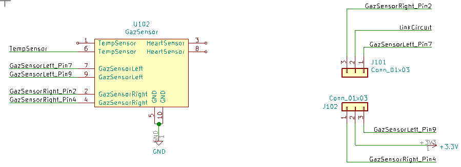
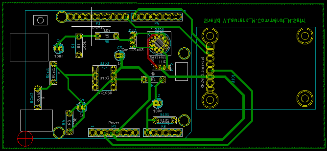
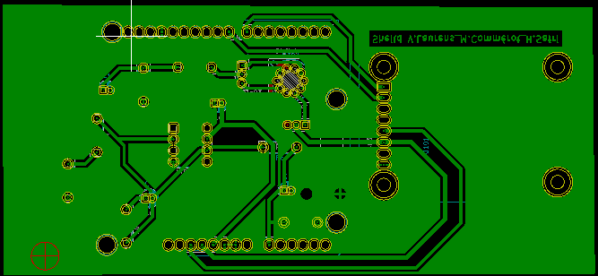

 <header>
 
 
 </header>
 <h1 style="text-align:center" >2019_MOSH_A1_VLAURENS_COMMEROT_SAFRI</h1>
<a href="./README_EN.md">Version Anglaise du README</a>

 ## Contenu

Ce projet KiCad contient le code source des TP sur Arduino et les fichiers de conception du shield réalisé dans le cadre du projet sur le capteur de Gaz", à savoir :
    La partie schématique, décrivant le circuit électronique implémenté (composants, routage des pins)
    La partie en couche, décrivant la forme de la carte, l’emplacement des différents éléments sur celle-ci et la trajectoire des pistes de routage.
    Une vu 3D montrant les résultat visuel de la carte lors qu'elle sera designé.

## 1. Travaux Pratiques sur Arduino

Ces travaux pratiques avaient pour principal objectif de nous apprendre à développer la partie intelligente de nos capteurs de gaz. En d'autres mots nous avons dans cette partie appris la composition d'une carte Arduino. Nous avons appris à pousser et tester des programmes sur le micro-controleur ATMEGA128 qui le compose.
Nous avons aussi appris à interfacer des circuit électroniques d'acquistion de données (capteurs) ou encore des circuits de puissances comme commander un cerveau moteur. 
Enfin nous avons développé un programme communicant via bluetooth avec le téléphne et qui permettait via une application android de commander l'allumage de LED.
Cette application android possédait des commande via button classique ou un module de reconnaissance vocale qui commandait l'arduino par des mot-clefs.

<figure class="image">
  
  <figcaption>Figure 1 : Aperçu de l'application Android</figcaption>
</figure>

# 2. PCB conception 

Dans un second temps, nous avons réalisé un projet qui visait à développer un module LoRa permettant de récupérer les valeurs de Gaz ambiant et les stocker sur une plateforme cloud "The think Network"

Nous avons donc dû interfacer l'antenne lora et surtout le capteur de gaz avec l'arduino uno.

Pour cela nous avons implémenté un montage (https://noullet-gei.gitlab.io/iss_analog/) dont le rôle est de filtrer le bruit et ainsi extraire toute l'information utile du capteur sans perturbation. Ci-dessous, le schéma d'acquisition de la donnée collectée par le capteur de Gaz.

<figure class="image">
  
  <figcaption>Figure 1 : Schéma électrique d'acquisition de la donnée du capteur</figcaption>
</figure>

Nous avons ensuite à l'aide kicad conçu une carte pouvant se gréffer à la carte Arduino Uno qui comporte le capteur de gaz et l'antenne LORA.
Pour ce faire nous avons implémenté via

<figure class="image">
  
  
  <figcaption>Figure 2 : EESCHEMA representation</figcaption>
</figure>

Nous avons tout d'abord, débuté par réaliser le circuit électronique. Il nous a donc fallu créer les composant électrique dont le premier que nous avons créé est le capteur de gaz et ses connecteur, ensuite nous les connecter entre-eux suivant le schéma de la figure 1.
Nous avons ensuite à l'aide de label lié les entrées et sortie de notre montage avec les PINs du module LORA que nous avons conçu, et les PINs de l'Arduino.
Ensuite nous avons vérifié les règles de routage afin de vérifié s'il n'ya vait pas de contradictions électriques.

Une fois le schéma électrique réalisé et vérifié, nous avons créé une empreinte pour chaque composant, notament pour le capteur de Gaz, le module Lora et l'ampli Opérationel. 
Enfin nous avons pu les router, les connecter comme illustré sur la figure 3.

<figure class="image">
  
  <figcaption>Figure 3 : Description du routage</figcaption>
</figure>

Nous savons qu'il est préférable, afin que le PCB, soit fabriqué à l'INSA de rassembler les routage sur une seule couche, afin de limiter le nombre de couche à deux, la coouche avant et arrière. De plus il nous à fallu resoecter certaines contraintes de taille des pistes et des trous. 
Afin donc de limiter le nombre de pistes et de concentrer le routage sur la face arrière seulement, nous avons conçu un plan de masse afin de se servir du bati du sheild comme masse.( Vue figure 4)
<figure class="image">
  
  <figcaption>Figure 4 : Description du routage avec une vue sur le pla de masse</figcaption>
</figure>

Nous vous laissons observer quelque vue réelle 3D de la carte finale.
<figure class="image">
  
  <figcaption>Figure 5 : Vue arrière 3D</figcaption>
</figure>

<figure class="image">
  
  <figcaption>Figure 5 : Vue avant 3D </figcaption>
</figure>

Un aperçu du routage

<figure class="image">
  
  <figcaption>Figure 5 : Vue 3D de côté</figcaption>
</figure>

# Pistes d'amélioration

Une piste sérieuse à améliorer serait de revoir la conception des compsants de base tels que les capacités car pour respecter les containtes de conception de l'INSA nous avons du modifier la taille des "PAD" et donc les faire se chevaucher.
Enfin nous pourrions représenter en vue 3D le capteur de Gaz ansi que le module lora et l'AOP.

# Conclusion

Au cours de ces TP nous avons eu l'occassion de programmer sur un Arduino.
Nous avons également appris à concevoir une carte électronique de bout en bout.
Ce module nous a appris à créer un capteur et à lui ajouter une certaine "intelligence" afin qu'il soit autônome
et puisse communiquer avec d'autres entité d'un système.
Nous avons réutilisé ces connaissances dans notre projet intégrateur durant lequel nous avons développé un module de capteurs intelligent pour surveiller la consommation d'énergie d'une douche.
