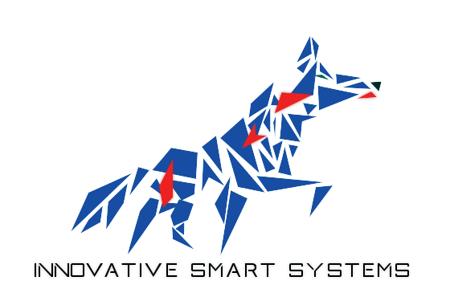
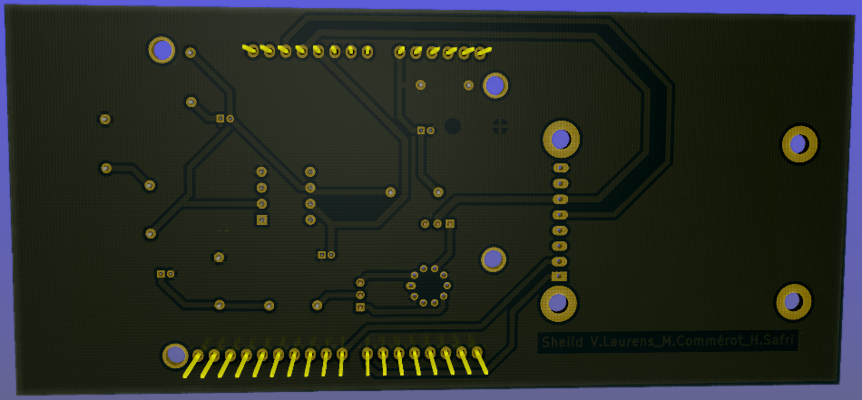
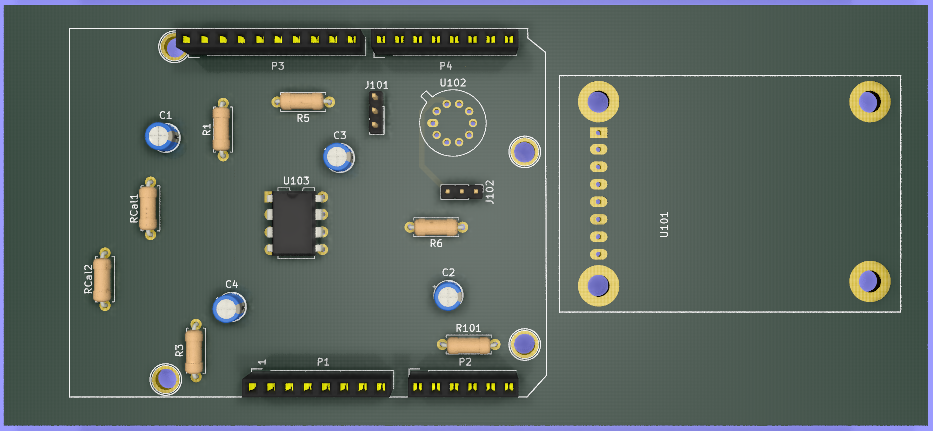

 <header>
 
 
 </header>
 <h1 style="text-align:center" >2019_MOSH_A1_VLAURENS_COMMEROT_SAFRI</h1>
 <a href="./README.md"> French Version</a>

 ## Contenu

This KiCad project contains the source code of the Arduino TPs and the design files of the shield realized within the framework of the Gas Sensor" project, i.e. : The schematic part, describing the implemented electronic circuit (components, pin routing) The layered part, describing the shape of the board, the location of the different elements on it and the trajectory of the routing tracks. A 3D view showing the visual results of the board as it is being designed.

## 1. Practical work on Arduino

The main objective of this practical work was to teach us how to develop the intelligent part of our gas sensors. In other words, in this part we learned the composition of an Arduino board. We learned how to push and test programs on the ATMEGA128 micro-controller that composes it. We also learned how to interface data acquisition electronic circuits (sensors) or power circuits such as controlling a motor brain. Finally, we developed a program that communicates via bluetooth with the phone and that allows via an android application to control the lighting of LEDs. This android application had commands via classic buttons or a voice recognition module that controlled the Arduino by keywords.

<figure class="image">
  
  <figcaption>Figure 1 :  Overview of the Android application</figcaption>
</figure>

# 2. PCB conception 

In a second phase, we carried out a project aimed at developing a LoRa module to retrieve ambient gas values and store them on a cloud platform "The think Network".

We therefore had to interface the lora antenna and especially the gas sensor with the arduino uno.

To do this we implemented an assembly (https://noullet-gei.gitlab.io/iss_analog/) whose role is to filter the noise and thus extract all the useful information from the sensor without disturbance. Below is the acquisition diagram of the data collected by the gas sensor.

<figure class="image">
  
  
  <figcaption>Figure 2 : Wiring diagram of sensor data acquisition</figcaption>
</figure>

We then used kicad to design a card that could be attached to the Arduino Uno card, which includes the gas sensor and the LORA antenna. To do this, we implemented via

<figure class="image">
  
  <figcaption>Figure 2 : EESCHEMA representation</figcaption>
</figure>
We started by making the electronic circuit. We then had to create the electrical components, we start to create gaz sensor and these connectors. Then we connect them together according to the diagram in figure 1. We then linked the inputs and outputs of our assembly with the PINs of the LORA module we designed, and the PINs of the Arduino. Then we checked the routing rules in order to verify if there are no electrical contradictions.

Once the electrical schematic was done and checked, we created a footprint for each component, including the gas sensor, the Lora module and the operational amplifier. Finally we were able to route and connect them as shown in figure 3.

<figure class="image">
  
  <figcaption>Figure 3 : Routing description</figcaption>
</figure>

We know that it is preferable, in order for the PCB to be manufactured at INSA, to gather the routings on a single layer, in order to limit the number of layers to two, the front and back layer. In addition, we had to resoect certain constraints on the size of the tracks and holes. In order to limit the number of tracks and to concentrate the routing on the back side only, we have designed a ground plane to use the sheild frame as a mass.( View figure 4)

<figure class="image">
  
  <figcaption>Figure 4 : Routing description with a view of the ground plate</figcaption>
</figure>

We let you see some real 3D view of the final map.
<figure class="image">
  
  <figcaption>Figure 5 : 3D rear view</figcaption>
</figure>

<figure class="image">
  
  <figcaption>Figure 5 : 3D front view </figcaption>
</figure>

An overview of routing

<figure class="image">
  
  <figcaption>Figure 5 : 3D side view</figcaption>
</figure>

# Pistes d'amélioration

One serious avenue for improvement would be to review the design of the basic components such as the capabilities because to meet the NHI's design constraints we had to modify the size of the "CSAs" and thus make them overlap. Finally we could represent in 3D view the gas sensor as well as the lora module and the PDO.

# Conclusion

During these labs we had the opportunity to program on an Arduino. We also learned how to design an electronic board from start to finish. This module taught us how to create a sensor and add some "intelligence" to it so that it is autonomous and can communicate with other entities in a system. We reused this knowledge in our integrator project during which we developed an intelligent sensor module to monitor the energy consumption of a shower.
